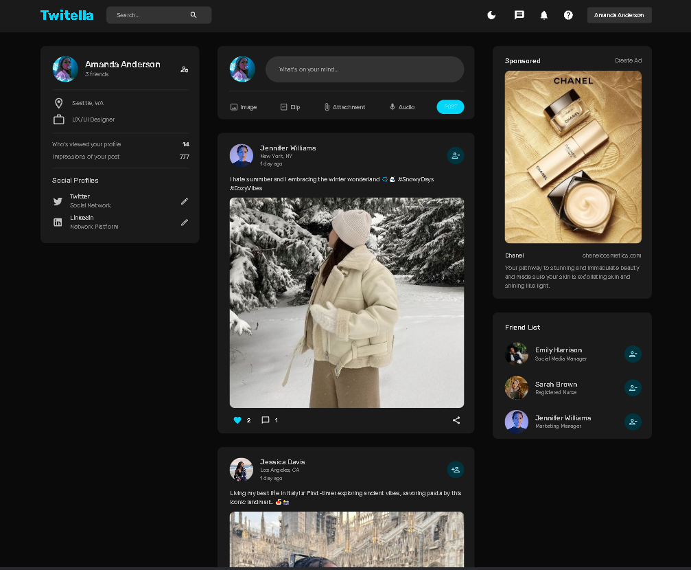
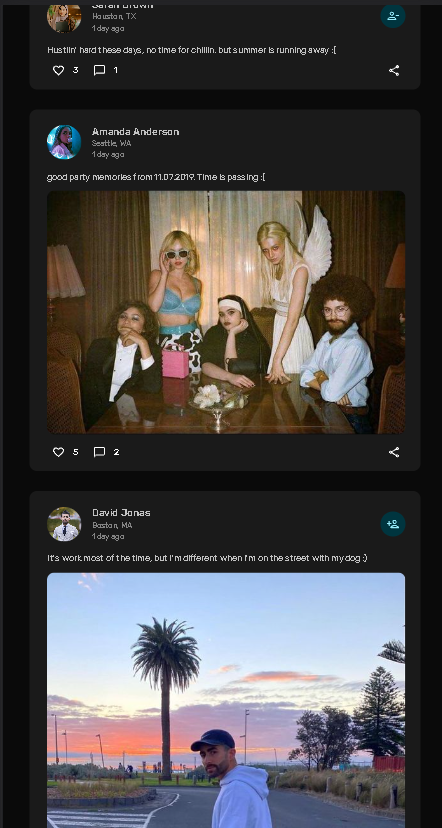

# TWITELLA

 

***Twitella*** is a cutting-edge MERN (MongoDB, Express.js, React, Node.js) stack application that empowers users to connect, share, and engage in meaningful conversations. Whether you're looking to stay updated on the latest trends, share your thoughts, or connect with like-minded individuals, Twitella provides a seamless platform to express yourself.

## Features

- ***Personalized Feeds:*** Tailored content recommendations ensure you never miss out on important updates.
- ***Interactive Posts:*** Share text, images, and links in a dynamic and engaging way.
- ***Intuitive User Interface:*** A sleek and user-friendly interface that prioritizes ease of use and aesthetics.
- ***Secure Authentication:*** Utilizing modern authentication techniques to ensure the safety and privacy of user data.
- ***Responsive Design:*** Seamlessly access Twitella on any device, whether it's a desktop, tablet, or smartphone.

## Technologies Used

- ***Frontend:*** Crafted with React.js and Material UI for a modern and interactive user interface.
- ***State Management:*** Utilized Redux for efficient state management and data flow.
- ***Backend:*** Node.js, Express.js for robust server-side development.
- ***Database:*** MongoDB for efficient data storage and retrieval.
- ***Authentication:*** Implemented secure user authentication for enhanced privacy.

## Explore Twitella

To experience Twitella firsthand, visit [twitella.com](https://www.twitella.com) and start connecting with the community today!

## Screenshots

Here are a few screenshots showcasing different aspects of Twitella:

  

    
  
 _Personalized Feeds: Stay informed with content that matters most to you._

  

  
  
_Personalized Feeds: Stay informed with content that matters most to you._

## Contributing

We welcome contributions from the community! To contribute to Twitella, please follow these steps:

1. Fork this repository.
2. Create a new branch with a descriptive name.
3. Commit your changes and push to your forked repository.
4. Submit a pull request with a detailed explanation of your changes.
